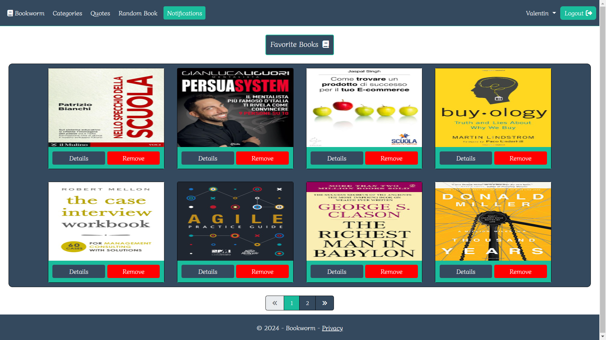

# 📚 Bookworm

Bookworm is an Asp.Net Core web application, where users can connect through their love for books and quotes. Users can upload and download books in different categories. They can also upload and browse through different type of quotes - movie, book or general quotes.

## 🔒 Secrets

To run this project, you will need to add the following secrets to your secrets.json:

```bash
{
  "SqlServerConnection": "",
  "AzureBlobStorage": {
    "AccountKey": "",
    "AccountName": "",
    "ContainerName": "",
    "StorageConnection": ""
  },
  "Authentication": {
    "Google": {
      "ClientId": "",
      "ClientSecret": ""
    },
    "Facebook": {
      "ClientId": "",
      "ClientSecret": ""
    }
  },
  "MailGunEmailSender": {
    "ApiKey": "",
    "Domain": "",
    "FromEmail": ""
  }
}
```

## 🚀 Tech Stack

- xUnit
- Select2
- SignalR
- TinyMCE
- Datatables
- Quartz.NET
- Html Sanitizer
- Font Awesome
- Asp.Net Core MVC
- Azure Blob Storage
- Entity Framework Core
- Mailgun Email Service

## Database Structure


## 📖 Documentation

**Admin Area**:

Area for displaying administrator related logic. Here the admin can approve/unapprove/delete books/quotes and also manage the users, for example assigning roles.

**Account Area**:

Area for displaying account related logic. Here the user can change their username/password/email.

**Pagination:**

Bookworm supports pagination to efficiently handle large collections of books and quotes. Instead of displaying all books/quotes at once, the collection is divided into pages, allowing you to navigate with ease.

***Guest user:***
- Can only browse through quotes without liking/uploading, etc.
- Can only browse through books without downloading/rating/uploading/commenting/addingToFavorites, etc.

***Logged-in user:***

- Can upload book
- Can upload quote
- Can download book
- Can search for quotes
- Can comment on book
- Can receive notifications
- Can rate someone else's books
- Can delete and edit own books
- Can like someone else's quote
- Can delete and edit own quotes
- Can filter books by their language
- Can delete and edit own comments
- Can vote on someont else's comment
- Can sort quotes by date and likes count
- Can change their username or password
- Can sort comments by date and net worth
- Can filter quotes by their type or liked quotes
- Can add someone else's books to favorite book list
- Can search for books by title, author/publisher name

***Administrator***:

- Can assign role to users
- Can delete comments of all users
- Can approve/unapprove/delete books and quotes

***Book Download***:

User can download a specific number of books a day. That number is calculated based on the user points. Every time a user book or quote is approved, that user gains points. For approved book is 5 points and for approved quote is 2 points. The opposite is also true - when an administrator unapproves a user book/quote, that user loses points.

Number of max daily downloads count based on points:

- Points < 100 -> 10 books
- Points >= 100 and < 200 -> 15 books
- Points >= 200 and < 300 -> 20 books
- Points >= 300 and < 400 -> 25 books
- Points >= 400 -> 30 books

That limitation does not apply for an administrator.

***Book Rating:***

A user can rate a book by giving it a number of stars ⭐, between one and five. The book's average rating is calculated and displayed on the details page.

***Book Upload***:

Uploaded books and images are being uploaded to Azure Blob Storage.
The book file, representing the book itself, can only be in *.pdf* format and the book image, representing the book cover, can only be in *.jpg*, *.jpeg*, *.png* format. The book's *.pdf* file can have a size of max *15 mb* and the book's image file can have a size of max *5 mb*.

***Scheduling jobs***

There are two backgroung jobs implemented using the Quartz.NET library.

- ResetDailyDownloadsCountJob - this job updates the database by setting the DailyDownloadsCount property of a user to be equal to zero. It's being executed every day at midnight.
- MarkOldNotificationsAsDeletedJob - this job marks old notifications as deleted in the database. It checks for old notifications every 10 minutes and if it finds such - it sets IsDelete to be true. Old notifications are those which are older than 3 days.

***Quote Upload***:

The user can choose from three different types of quotes to upload - movie, book or general quote. When the uploaded quote is approved by admin it becomes visible for everyone and the user gains 2 points.

***Quote Like***:

The user cannot like his/her own quotes, but can like someone else's quote.

## Images

#### Home


#### Recent Books


#### Popular Books


#### Notifications


#### Login/Register


#### Admin Area


#### Manage Approved Books


#### Favoite Books



#### Quotes


#### Book Details


## Acknowledgements

 - [Asp.Net Core Template](https://github.com/NikolayIT/ASP.NET-Core-Template)

## License

This project is licensed under the [MIT License](https://choosealicense.com/licenses/mit/).